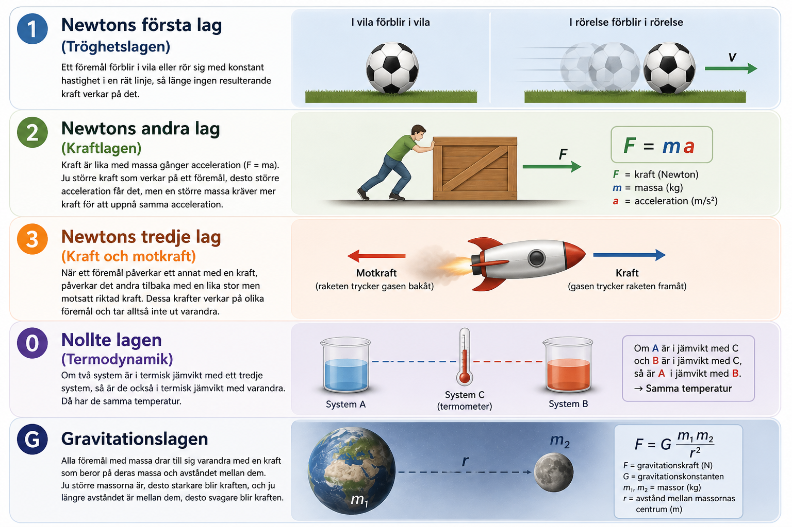
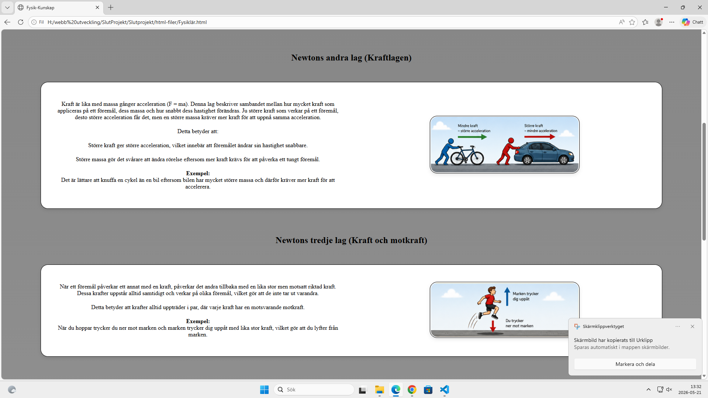

# Fysik

I min projekt kommer jag ha en main sida där jag förklarar basic infor och två sub sidor där en är för lära ämnet och den andra för att testa sig genom en quiz. jag lär ut fysik mer specifikt newtons lagar. Det där är huvud information om min projekt.

## Index

I min index har jag basic info om vad jag kommer att prata om och dem sitter i boxes så att det tydligt och att allt finns i en sida så att man inte måste skrolla för att fortsätta läsa. längst nere har jag en länk till nästa sidan (fysiklär) där dem kan läsa mer.

## Fysiklär

I min fysiklär sidan har jag text i 2/3 delar av min "box" och i den sista 1/3 finns bilden. När man har väl läst klart så kan man gå till quiz (fysiktesta) där man kan testa sig genom quiz.

## FysikTesta

I min fysiktesta kan du testa dig på dina kunskaper inom fysik genom en quiz. Du får fyra alternativ som du får välja mellan som du kan få resultat direkt efter quizzen så att du vet vad du måste lära dig.

## Manuel tester och automatik tester

Jag har testat i 4 olika typer av webbplatser. Chrome, Microsoft edge och Firefox. Har fixat prettier och gjort det för alla html och css samt javascript.

# Bilder

## **Bilder för hur min slutprojekt ser ut**

## **Bilder för att visa att min webbsida går och öppna i minst 3 olika typer av webbplatser**

